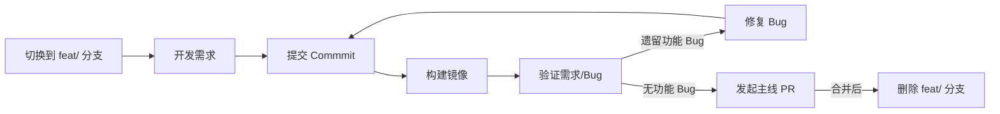
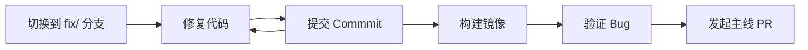

# Contributing to KWeaver DIP

本指南描述如何基于当前组织架构及 Vibe Coding 为主的开发模式进行设计-开发-测试

## 项目结构

```
.
├── .github/
│   └── workflows/        # CI/CD 流水线
├── deploy/               # 部署脚本及配置
├── docs/                 # 项目文档
├── design/               # 特性设计及交互设计
├── release-notes/        # 版本发布说明
├── web/                  # 前端代码
├── studio/               # 数字员工平台模块
├── dsg/                  # 数据语义治理模块
├── chat-data/            # “数据分析员”模块
├── hub/                  # 应用商店模块
└── skills/               # AI Agent 技能
```

## 角色和职责

| 角色 | 职责                                                         |
| ---- | ------------------------------------------------------------ |
| 研发 | - 负责产品特性/功能的逻辑设计<br>- 负责功能的全栈开发<br>- 负责功能的 Bug 修复和验证 |
| 设计 | - 负责产品功能的 UI/UX 设计<br>- 负责功能的交互体验验收<br>- 负责交互体验 Bug 的验证 |
| 测试 | - 负责产品功能/评测集的用例编写<br>- 负责功能测试、接口测试<br>- 负责功能/接口 Bug 的验证 |

## 流程

### 功能开发

**为避免功能开发影响 main 和 release 稳定性，需求分支必须在 feat/ 分支测试通过后才能合并到主线。**



#### 开发阶段

- **分支命名**：需求分支以 `feat/<id>-<name>` 来命名，`id` 为 GitHub ISSUE 号，`name` 为简单的英文标题，例如需求 “数字员工的权限管控 #122” 的分支名为：`feat/122-access-control` 
- **Commit 要求**：增量提交功能变更时，在一次 Commit 中一起包含前端 + 后端代码，确保一次 Commit 包含完整的内容更新
- **Bug处理**：需求分支的 Bug 在需求合并主线之前，直接在需求分支上处理即可；需求合并主线之后，在 fix/ 分支处理

#### 合并阶段

- **更新代码**：使用 `git rebase` 更新代码。不要使用 merge，以免产生过多的分叉以及无意义的 merge commit
- **Commit 修剪**：需求分支合并到主线时，可以对 commit 进行一些修剪，但要保留重要的 commit，不要合并成一个
- **删除分支**：需求分支合并主线之后需要被删除，避免遗留过多的 feat/ 分支

### 设计变更

- **快速处理**：研发可以对一些细节逻辑经过与设计、测试讨论后直接更新代码，不需要依赖设计变更（前提是三方达成一致）

### Bug 修复



- **固定分支**：每个模块创建一个 fix/ 分支，用于持续修复和验证 Bug。该分支同时适用前端和后端，命名建议是统一使用 `fix/<module>-bugs`，其中 <module> 与模块的目录名称保持一致（ web 不需要单独的 fix/ 分支）。例如，DIP Studio 前端和后端专用 fix 分支为：`fix/studio-bugs`
- **批量处理**：fix/ 分支可以持续提交 Bug 修复，并在需要测试验证构建一个镜像，这样可以在批量处理 Bug 的同时又避免影响 main
- **完整提交**：修复 Bug 时，在一次 Commit 中一起包含前端 + 后端代码，确保一次 Commit 包含完整的修复
- **明确镜像**：流转 ISSUE 到测试时，写明需要更换的镜像完整路径，如：`swr.cn-east-3.myhuaweicloud.com/kweaver-ai/dip/dip-frontend:0.5.0-fix-studio-bugs.dc6c369.202604241739`，特别留意需要同时更新前端 + 后端镜像的情况
- **避免**使用 latest 镜像，否则可能造成无法拉最新镜像
- 没有 Chart 变更时，直接 edit deployment 替换镜像

### 版本规划

- **需求整理**：模块负责人需要在下一个版本开始之前（通常是本版本 release 阶段）整理关键需求，输入到整体看板
- **更新版本**：研发负责人在拉 release 之后更新 `VERSION` 到下一个版本，例如：在 `relese/v0.5.0` 阶段需要更新 `VERSION` 到 0.6.0

### 发布阶段

- **通知**：研发负责人通知进入发布测试阶段
- 发布阶段需要执行：
  1. `kweaver-dip` 项目拉取 `release/v0.x.0` 分支
  2. 各模块构建 `release/v0.x.0` 的镜像
  3. 各模块构建 `release/v0.x.0` 的 Chart 包，提交到 `helm-repo` 仓库
  4. 并同步更新 `deploy/release-manifests/0.x.0` 下的 YAML
  5. 测试使用 `release/v0.x.0` 分支的部署脚本更新模块
- `release/v0.x.0` 分支有代码更新时，修改 Chart 的 `containers[].image` 的镜像 tag

### 发布后

- **分支合并**：发布后由研发负责人合并 release 分支到 main，合并后删除  release 分支
- **发布 Tag**：在 GitHub 打发布 tag

### 镜像和 Chart

- 镜像用于：
  * 特性/需求提交
  * Bug 修复
- 只有在以下场景需要更新 Chart：
  * 构建正式发布的安装包和补丁包
  * K8s 部署配置变更
- Chart 规则：<VERSION>-<分支号>-<时间>.<commit-id>。例如：
  * release 分支：0.6.0-release-20260427101259.a12bc3e
  * 主线：0.6.0-main-20260427101259.a12bc3e
  * 需求分支：0.6.0-feat-channel-message-20260427101259.a12bc3e
  * Bug 分支：0.6.0-fix-studio-bugs-20260427101259.a12bc3e
 - 镜像 tag 规则：<VERSION>-<分支号>-<时间>.<commit-id>.<架构>。例如：
   * 0.6.0-main-20260427101259.a12bc3e.amd64/arm64

### ISSUE 流转

- 研发提供包含对应修改的镜像号，测试修改 deployment 的 `containers[].image`，在不更新 Chart 的前提下拉取新的镜像
- 确认问题时，通过 deployment 的镜像 tag 来确认实际使用的镜像