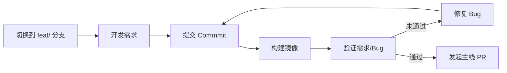
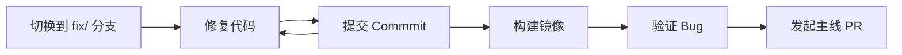

# Contributing to KWeaver DIP

本指南描述如何基于当前组织架构及 Vibe Coding 为主的开发模式进行设计-开发-测试

## 项目结构

```
.
├── .github/
│   └── workflows/        # CI/CD 流水线
├── deploy/               # 部署脚本及配置
├── docs/                 # 项目文档
├── design/               # 特性设计及交互设计
├── release-notes/        # 版本发布说明
├── web/                  # 前端代码
├── studio/               # 数字员工平台模块
├── dsg/                  # 数据语义治理模块
├── chat-data/            # “数据分析员”模块
├── hub/                  # 应用商店模块
└── skills/               # AI Agent 技能
```

## 角色和职责

| 角色 | 职责 |
| -- | -- |
| 研发 | - 负责产品特性/功能的逻辑设计<br>- 负责功能的全栈开发<br>- 负责功能的 Bug 修复和验证 |
| 设计 | - 负责产品功能的 UI/UX 设计<br>- 负责功能的交互体验验收<br>- 负责交互体验 Bug 的验证 |
| 测试 | - 负责产品功能的测试用例编写<br>- 负责功能测试、接口测试<br>- 负责功能/接口 Bug 的验证 |

## 流程

### 功能开发



- 需求分支以 `feat/<id>-<name>` 来命名，`id` 为 GitHub ISSUE 号，`name` 为简单的英文标题，例如需求 “数字员工的权限管控 #122” 的分支名为：`feat/122-access-control` 
- 需求分支的 Bug ，在需求合并到主线前后提交到不同的分支：
  * 需求合并主线之前，直接在需求分支上处理即可
  * 需求合并主线之后，在 fix/ 分支处理

### Bug 修复



- 每个模块创建一个 fix/ 分支，用于持续 Bug 修复和验证，例如：DIP Studio 专用 fix 分支为：`fix/dip-studio`
- fix/ 分支可以持续提交 Bug 修复，并在需要测试验证构建一个镜像，这样可以在批量处理 Bug 的同时又避免影响 main

### 发布阶段

- 由测试负责人通知研发负责人进入发布阶段
- 发布阶段需要执行：
  1. `kweaver-dip` 项目拉取 `release/v0.x.0` 分支
  2. 各模块构建 `release/v0.x.0` 的镜像
  3. 各模块构建一个 `release/v0.x.0` 的 Chart 包，提交到 `helm-repo` 仓库
  4. 并同步更新 `deploy/release-manifests/0.x.0` 下的 YAML 
  5. 测试使用 `release/v0.x.0` 分支的部署脚本更新模块
- `release/v0.x.0` 分支有代码更新时，修改 Chart 的 `containers[].image` 的镜像 tag

### 镜像和 Chart

- 每次有代码变更都需要通过流水线自动构建镜像
- 镜像用于：
  * 特性/需求提交
  * Bug 修复
- 只有在以下场景需要更新 Chart：
  * 构建正式发布的安装包和补丁包
  * K8s 部署配置变更

- Chart 规则：
  * Chart Version：<版本号>-<分支号>

- 测试阶段使用主线 Chart 部署服务。
- 研发提供包含对应修改的镜像号，测试修改 deployment 的 `containers[].image`，在不更新 Chart 的前提下拉取新的镜像。
- 确认问题时，通过镜像 tag 而非 Chart Version 来确认实际使用的镜像。

