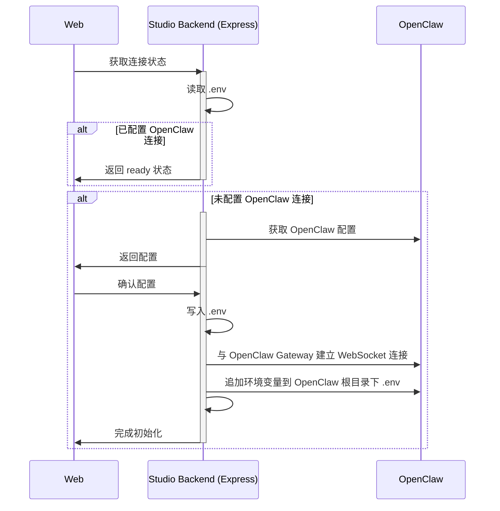

# 初始化引导

## 业务流程

前提：本业务流程**仅适用** Studio Backend (Express) 和 OpenClaw 部署在同一节点的情况。



## openclaw 命令

### 读取 OpenClaw 配置
执行命令：`openclaw gateway status`，从输出中读取 OpenClaw 配置文件路径、网关协议、地址和端口。

- 如果命令返回 `command not found: openclaw`，表示未部署 OpenClaw。
- 命令执行成功后，提取以下结构：

1. `config_path`：
```bash
Config (service): {{ config_path }}
```
例如：`Config (service): ~/.openclaw-dev/openclaw.json`

2. `protocol`、`host` 和 `port`：
```bash
Probe target: {{ protocol }}://{{ host }}:{{ port }}
```
例入：`Probe target: ws://127.0.0.1:19001`

### 读取 token

从 `config_path` 中读取 `gateway.auth.token` 字段。 

## 初始化 Studio

Studio Backend 读取完配置（成功或失败）后：

- 如果未部署 OpenClaw，返回 500 错误
- 如果读取到配置，返回配置信息

用户可以在 Web 修改配置信息，配置项包括：

* OpenClaw 网关连接地址
* OpenClaw 网关 Token（不显示明文）
* KWeaver 服务地址（访问 KWeaver API 需要，可选）
* KWeaver Token（默认禁用，如填写了 KWeaver 服务地址，则启用且必填）

用户修改并确认配置后发送初始化请求到 Studio Backend， Studio Backend 执行初始化操作：

1. 如果不存在 `.env` 文件，则先根据 `.env.example` 模板创建 `.env`。
2. 将初始化请求参数转换为 `.env` 中的对应参数填入。
3. 创建 `assets/`目录，执行 OpenSSL 命令生成 Ed25519 PEM 私钥和 PEM 公钥，用于调用 OpenClaw Gateway 接口时进行签名：
```bash
cd assets
openssl genpkey -algorithm ED25519 -out private.pem
openssl pkey -in private.pem -pubout -out public.pem
```
4. 执行 `npm run init:agents` 初始化 OpenClaw 默认配置、built-in agents 以及 extensions。
5. 初始化成功后，与 OpenClaw Gateway 建立 WebSocket 连接。
6. 连接成功后，追加 KWEAVER_BASE_URL 和 KWEAVER_TOKEN 到 OpenClaw 根目录下的 .env 文件（没有则创建）
7. 返回初始化结果。

## HTTP 接口

Studio Backend 提供以下 HTTP 接口：

- 获取 DIP Studio 系统初始化状态；
- 获取 OpenClaw 配置；
- 完成 DIP Studio 系统初始化；

